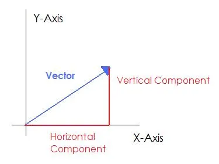

# lars Learning Series - Part 1
## Building a 2D Vector Type in Rust

---

###  Learning Goals
By the end of this lesson, students will:

- Understand how 2D vectors are represented mathematically and in code.  
- Implement a `Vec2` struct in Rust that supports basic vector operations.  
- Learn about traits, operator overloading, and code organization in a math-focused crate.  
- Write unit tests to validate mathematical correctness.  

---

## Background: What Is a Vector?

As you hopefully know from school, a **vector** is a quantity that has both **magnitude** (length) and **direction**. If not, I will give you a whistlestop tour, or you can read an introductory article [here](https://www.mathsisfun.com/algebra/vectors.html).

In 2D space, we have multiple ways to notate vectors, the main one I will use is "Column Notation", which shows a vector as:


Another common way to represent vectors is using Unit Vectors and Components.
### Unit Vectors
**Unit** vectors are vectors that has a magnitude of 1 in a specific direction. for example:


You will often see unit vectors denoted with a hat symbol (^) above the vector name.
Additionally, you may see the unit vector for the x direction written as  and for the y direction as .

Therefore, to express a vector with x-component 3 and y-component 4, with unit vectors, we can write:


### Magnitude



**Magnitude** (or length) of a vector is the distance from the origin to the point defined by the vector. As you should see from the diagram above, it is calculated using the Pythagorean theorem:


The notation for a vector 's magnitude is .

### Vector Addition and Subtraction
Vectors can be added and subtracted component-wise. For example, given two vectors:


The addition and subtraction of these vectors is defined as:


### Scalar Multiplication and Division
Vectors can be multiplied or divided by a scalar (a single number) by multiplying or dividing each component of the vector by that scalar. For example, given a vector:


The scalar multiplication and division of this vector by a scalar k is defined as:


### The Dot Product
The dot product is a method for multiplying 2 vectors, it is notated mathematically as follows:


There are 2 methods to calculate the dot product

The first method:


The second method:


Where  and  are the x and y components of vector a respectively, and the same applies to vector b.

Vectors are foundational in:
- Geometry (lines, points, and normals)  
- Physics (velocity, force, acceleration and pretty much everything else!)  
- Computer graphics (movement, transformations)  
- Game development (positions, rotations, collision detection)


Let us now take our first step towards creating a 2D vector struct in Rust!


---

##  Task 1: Defining a 2D Vector Type

First off, we need to create a Rust struct called `Vec2` to represent a 2D vector.
- It should contain `(x,y)` variables
- You should [Derive](https://doc.rust-lang.org/rust-by-example/trait/derive.html) common traits such as `Clone`, `Copy`, `Debug`, `PartialEq` and `Constructor`
- Finally, you should define a few useful common constant vectors such as `ZERO`, `ONE` and **unit** vectors for the x and y directions.


This sets the foundation for all vector operations.
<details>
<summary>Solution</summary>

```rust
#[derive(Add, Sub, Div, Mul, Neg, Clone, Copy, Debug, PartialEq, PartialOrd, Constructor)]
pub struct Vec2 {
pub x: f64,
pub y: f64,
}


impl Vec2 {
pub const ZERO: Vec2 = Vec2 { x: 0.0, y: 0.0 };
pub const ONE: Vec2 = Vec2 { x: 1.0, y: 1.0 };
pub const UNIT_X: Vec2 = Vec2 { x: 1.0, y: 0.0 };
pub const UNIT_Y: Vec2 = Vec2 { x: 0.0, y: 1.0 };
}
``` 
</details>


---

##  Task 2: Computing Magnitude (Vector Length)

---
##  Task 3: Vector Arithmetic

---

##  Task 4: The Dot Product

---


---

##  Task 6: Normalizing a Vector


---

##  Task 7: Component Mapping

---

##  Task 8: Scalar Multiplication

---

##  Task 9: Using Vec2 as a Point


---

##  Task 10: Testing and Validation


